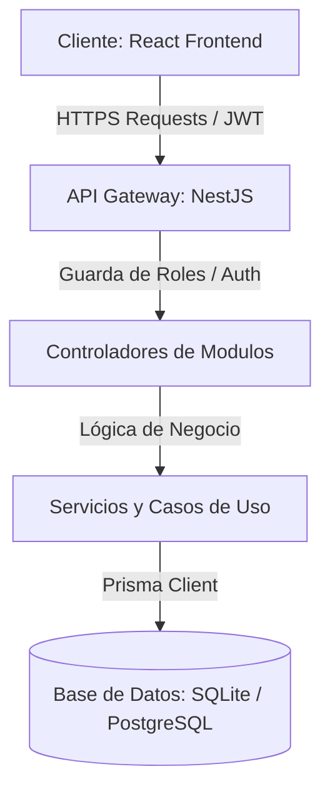

# Diseño de Arquitectura y Flujos - Lácteos MRP

Este documento detalla la arquitectura, el modelo de datos y los flujos operativos clave del ERP **Lácteos MRP**, un sistema diseñado específicamente para la producción, trazabilidad y control de calidad en la industria alimentaria láctea.

---

## 1. Visión General de la Arquitectura

El sistema está estructurado bajo un modelo de arquitectura de tres capas:
1. **Presentación (Frontend):** React (con TypeScript, Vite y Material UI), que interactúa de manera asíncrona con el backend mediante un cliente HTTP unificado (`apiFetch`).
2. **Servicio y Negocio (Backend):** NestJS (Node.js) estructurado modularmente con controladores, servicios y guardias de seguridad basados en roles.
3. **Persistencia (Base de Datos):** Base de datos relacional modelada con Prisma ORM (soporta SQLite para desarrollo y PostgreSQL para producción).



---

## 2. Modelo de Datos Lácteo

El modelo de base de datos (`schema.prisma`) integra los módulos de Inventario, Cadena de Frío, Producción y Calidad de manera relacional para garantizar la trazabilidad completa.

```mermaid
erref
  "Receta" }|..|| "Producto (Final)" : "produce"
  "RecetaDetalle" }|..|| "Receta" : "contiene"
  "RecetaDetalle" }|..|| "Producto (Materia Prima)" : "requiere"
  "OrdenProduccion" }|..|| "Receta" : "usa"
  "OrdenProduccion" }|..|| "Usuario" : "responsable"
  "Lote" }|..|| "Producto" : "asociado a"
  "Lote" }|..|| "OrdenProduccion" : "originado por"
  "ControlLeche" }|..|| "Lote" : "verifica"
  "ControlCalidad" }|..|| "OrdenProduccion" : "inspecciona"
  "NoConformidad" }|..|| "Usuario" : "reportado por"
```

### Entidades Principales
*   **Producto:** Define SKU, costo, precio de venta, categoría (`MATERIA_PRIMA`, `INSUMOS`, `YOGURT`, `QUESOS`, etc.) y vida útil en días (`vidaUtilDias`).
*   **Receta & RecetaDetalle:** Estructura del Bill of Materials (BOM) que define los ingredientes necesarios y sus cantidades requeridas por lote estándar.
*   **Lote:** Registra stock de materias primas o productos terminados con fecha de vencimiento (`fechaVencimiento`) para implementar consumo FEFO.
*   **OrdenProduccion:** Ciclo de vida de producción (`PLANIFICADA`, `EN_PROCESO`, `COMPLETADA`, `CANCELADA`).
*   **ControlLeche:** Parámetros físicoquímicos (temperatura, acidez, grasa, proteínas, antibióticos) tomados en la recepción de leche cruda.
*   **ControlCalidad:** Auditorías en proceso o de producto terminado.
*   **NoConformidad:** Registro de desviaciones del proceso con evidencia en base64/imagen y plan de acciones correctivas.

---

## 3. Algoritmo de Consumo de Inventario FEFO (First Expired, First Out)

Para evitar mermas por vencimiento de materias primas, el ERP implementa de manera estricta el algoritmo **FEFO**. Cuando se completa una Orden de Producción, el sistema deduce automáticamente los ingredientes consumidos siguiendo este orden lógico:

1. Busca todos los lotes con stock disponible del ingrediente correspondiente en la sucursal de la orden de producción.
2. Ordena los lotes por `fechaVencimiento` de forma ascendente (el lote más próximo a expirar primero).
3. Consume el stock secuencialmente hasta satisfacer la cantidad total requerida por la receta.
4. Genera movimientos de inventario tipo `SALIDA_PRODUCCION` para auditar la trazabilidad de cada lote consumido.

```typescript
// Pseudocódigo del Descuento FEFO en Producción
for (const ingrediente of receta.detalles) {
  const cantidadRequerida = ingrediente.cantidadRequerida * (cantidadProducida / receta.cantidadEsperada);
  
  const lotesDisponibles = await prisma.lote.findMany({
    where: { productoId: ingrediente.productoId, sucursalId, cantidadActual: { gt: 0 } },
    orderBy: { fechaVencimiento: 'asc' }
  });

  let restante = cantidadRequerida;
  for (const lote of lotesDisponibles) {
    if (restante <= 0) break;
    const aDescontar = Math.min(lote.cantidadActual, restante);
    
    await prisma.lote.update({
      where: { id: lote.id },
      data: { cantidadActual: { decrement: aDescontar } }
    });
    
    restante -= aDescontar;
  }
}
```

---

## 4. Control de Calidad y Puntos Críticos de Control (HACCP)

El sistema de calidad está diseñado para satisfacer las regulaciones de inocuidad alimentaria mediante:

1.  **Recepción de Materia Prima:** Obliga al registro de temperatura (límite crítico de 4°C) y pruebas rápidas de antibióticos. Si hay antibióticos, el lote se bloquea de manera inmediata en la base de datos cambiando el resultado a `RECHAZADO`.
2.  **Seguridad y Auditoría:** Al registrar un control de leche, el inspector debe estampar su firma digital autorizada, almacenada de forma segura en el registro.
3.  **Trazabilidad Bidireccional:** El sistema puede rastrear desde un producto terminado en POS, pasando por el lote de producción, hasta los lotes de leche y fermentos consumidos en la receta.
4.  **No Conformidades:** Al declararse una NC, el lote o freezer se coloca automáticamente en cuarentena, bloqueando su venta o uso hasta que el responsable registre las acciones correctivas aplicadas.

---

## 5. Control de Acceso Basado en Roles (RBAC)

Las operaciones sensibles están protegidas en el backend y frontend mediante las siguientes políticas:

| Rol | Dashboard | POS/Ventas | Inventario CRUD | Planificar OP | Completar OP / Mermas | Control Calidad / NC |
| :--- | :---: | :---: | :---: | :---: | :---: | :---: |
| **ADMINISTRADOR** | Sí | Sí | Sí | Sí | Sí | Sí |
| **SUPERVISOR** | Sí | Sí | Sí | Sí | Sí | Sí |
| **ALMACEN** | Sí | No | Lectura | Sí | Sí | No |
| **CALIDAD** | Sí | No | Lectura | No | No | Sí |
| **CAJERO** | Sí (POS) | Sí | No | No | No | No |
